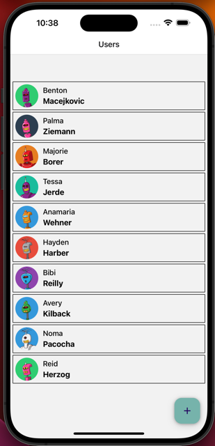
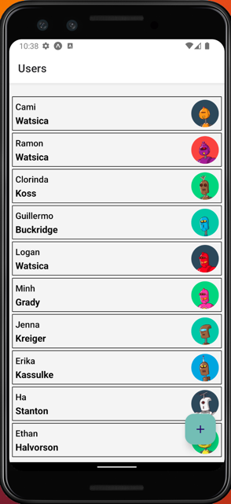

# MADD 9135 - Assignment 2

Link to the details of the assignment: https://mad9135.github.io/f2023/deliverables/assign.html#_2-react-native-app

## Installation

1. Clone the repository

```bash
git clone https://github.com/ulut0002/MAD9135-Assignment-2.git
cd MAD9135-Assignment-2
```

2. Install dependencies:

```bash
npm install
```

3. Run the app

```bash
npm start
```

4. Scan the QR code and run the app on Expo.dev

## Screenshots

### IOS



### ANDROID



## License

This project is licensed under the MIT License
